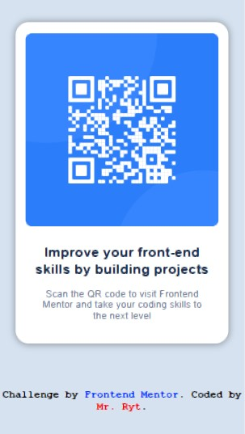

# Frontend Mentor - QR code component solution

This is a solution to the [QR code component challenge on Frontend Mentor](https://www.frontendmentor.io/challenges/qr-code-component-iux_sIO_H). Frontend Mentor challenges help you improve your coding skills by building realistic projects.

## Table of contents

- [Overview](#overview)
  - [Screenshot](#screenshot)
- [My process](#my-process)
  - [Built with](#built-with)
  - [What I learned](#what-i-learned)
  - [Continued development](#continued-development)
- [Author](#author)
- [Acknowledgments](#acknowledgments)

## Overview

### Screenshot




## My process

### Built with

- Semantic HTML5 markup
- CSS custom properties
- Flexbox
- CSS Grid
- Mobile-first workflow
- [Styled Components]("https://fonts.google.com/specimen/Outfit") - For css fonts

### What I learned

- I learnt how to add the webpage's icon in the head.

```html
<head>
  <link
    rel="icon"
    type="image/png"
    sizes="32x32"
    href="./images/favicon-32x32.png"
  />
</head>
```

- I learnt how to import a font and apply it in css.

### Continued development

I want to focus on working on the contents in the head tag, especially importing fonts, scripts and others.

## Author

- Frontend Mentor - [@MrRyt247](https://www.frontendmentor.io/profile/MrRyt247)
- Twitter - [@MrRyt19](https://www.twitter.com/MrRyt19?t=7|9R5z1MSEmgcekuJ_1ujA&s=09)

## Acknowledgments

Thanks to Sololearn and Mimo dev team for creating apps that offer free web development lessons
